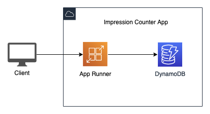

# AWS App Runner - Page Impression Counter App

This repository was built for demoing how to deploy a "Bring your own code" project to [AWS App Runner](https://aws.amazon.com/apprunner/), following a short clip that was uploaded to YouTube in Hebrew. In the short clip you will be able to see a step by step console demo, and this repository will demonstrate how to deploy the app using AWS Cli.

The application is a very simple page impression counter `nodejs` app for demo purposes only, that is built and deployed to AWS App Runner service, the app will use a DynamoDB table as described in the following diagram as a counter.

## Prerequisite

1. [`awscli`](https://docs.aws.amazon.com/cli/latest/userguide/install-cliv2.html) >= 2.2.34, if you are using AWS CLI [version 1](https://docs.aws.amazon.com/cli/latest/userguide/install-cliv1.html), you might get errors on `--no-cli-pager` switch of `Unknown options`, you can remove it from the scripts.  
2. In AWS App Runner console, create a GitHub connection, and named it `github` as described in our [documentation](https://docs.aws.amazon.com/apprunner/latest/dg/manage-connections.html).

## Deploying the App

In the `./scripts` folder are all the scripts that you can use to deploy this app.

**Steps:**

1. `1_prep_dynamodb.sh` - Creates the counter DynamoDB table.
2. `2_permissions.sh` - Creates proper permissions for app runner task to access DynamoDB securely.
3. Create App Runner service with Github hook auto deployment `3_apprunner_github.sh`
4. showing the auto scale with stressing the application with `wrk` using `6_stress_test.sh`

### Optional Deployment from ECR

In AWS App Runner, in addition built and run your code, as described above, you also have the option to run your container.
In order to deploy your container, you will need to build this app using the `Dockerfile` and push it to your [ECR](https://aws.amazon.com/ecr/) Repository.

>Make sure you have Docker installed and running, and you have IAM permissions to create and push to an ECR repository.

**Steps:**

1. To create an ECR repository, build and push the application docker image `4_create_ecr_build_push.sh`
2. Create App Runner service with ECR auto deployment `5_apprunner_ecr.sh`

### Security

See [CONTRIBUTING](CONTRIBUTING.md#security-issue-notifications) for more information.

### License

This repository is licensed under the MIT-0 License. See the LICENSE file.
